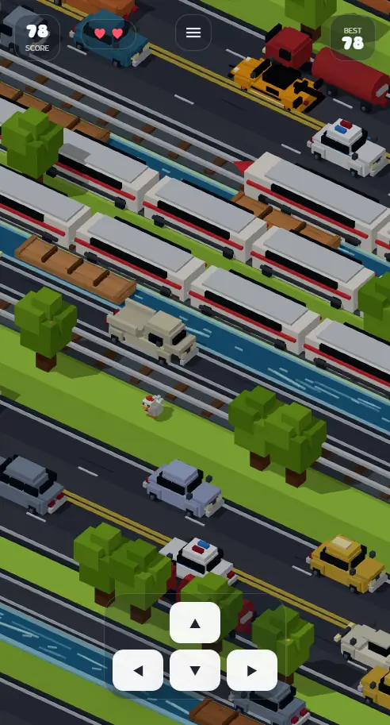

# Ayam SD

[](https://github.com/masarray/ayam/actions/workflows/ci.yml)
[](https://github.com/masarray/ayam/actions/workflows/deploy-pages.yml)


**Ayam SD** is a free and open-source browser mini-game built with **React, Vite, and Three.js**. The player controls a voxel chicken through roads, trains, rivers, sinking planks, rewards, sound effects, badge progress, and a post-game learning quiz loop.

It is designed for kids, lightweight public deployment, and easy integration into an educational web app.

Live demo after GitHub Pages deployment:

```txt
https://masarray.github.io/ayam/
```



## Why this game is useful

Many educational games become heavy, slow, or too complicated before the learning loop is even enjoyable. Ayam SD keeps the core loop simple: short play session, clear reward, then a randomized quiz after repeated game-over events. This makes the game suitable as a small engagement layer for a learning site, quiz app, or children-focused PWA.

The repository avoids third-party game branding and official copyrighted game assets. Visuals are built from procedural Three.js geometry, with user-supplied audio clearly documented.

## Highlights

- **Three.js voxel gameplay** with procedural chicken, roads, vehicles, trains, rivers, planks, particles, and camera movement.
- **Responsive browser controls** for keyboard, swipe, and on-screen mobile D-pad.
- **Game-feel polish** including screen shake, splash feedback, feather burst, near-miss text, high-score reward, confetti, and tactile quiz answer animation.
- **Learning loop** with a lazy-loaded question bank, 5 randomized questions, shuffled answers, explanation text, and fresh-question rotation.
- **Badge and reward system** to give children visible progress beyond only a high score.
- **Audio layer** with lazy-loaded music, optional sound effects, runtime-generated Web Audio feedback, and settings toggles.
- **PWA-ready structure** with manifest, service worker, icons, sitemap, robots file, and GitHub Pages workflow.
- **Public-repo hygiene** with Apache-2.0 license, third-party notices, asset licensing guide, security policy, contribution guide, issue templates, CI, and Pages deployment.

## Quick start

Requirements:

```txt
Node.js 20 or newer
npm
```

Run locally:

```bash
npm install
npm run dev
```

Open the Vite URL shown in the terminal.

## Build and preview

```bash
npm run verify
npm run build
npm run preview
```

The production build is generated in `dist/`.

## Controls

| Action | Keyboard | Mobile |
|---|---|---|
| Start / restart | `Space`, `Enter`, `WASD`, or arrow keys | Tap **Mulai Main** / **Main Lagi** |
| Move | `WASD` or arrow keys | Swipe or on-screen D-pad |
| Pause / menu | Menu button | Menu button |
| Audio settings | Settings menu | Settings menu |

## Deploy to GitHub Pages

This repository is configured to deploy using **GitHub Actions**, not a `gh-pages` branch.

Workflow file:

```txt
.github/workflows/deploy-pages.yml
```

One-time GitHub setting:

1. Open the repository on GitHub.
2. Go to **Settings → Pages**.
3. Set **Build and deployment → Source** to **GitHub Actions**.
4. Push to `main`.
5. Open the deployment URL from the workflow summary.

For this repository name, the expected public URL is:

```txt
https://masarray.github.io/ayam/
```

## Recommended GitHub repository setup

```txt
Repository name : ayam
Description     : Free open-source Three.js Ayam SD browser game with voxel chicken gameplay, mobile controls, rewards, badges, audio, quiz learning, PWA support, and GitHub Pages deployment.
Website         : https://masarray.github.io/ayam/
Topics          : ayam-sd, threejs, react, vite, web-game, voxel-game, browser-game, github-pages, educational-game, kids-game, mobile-game, pwa
License         : Apache-2.0
Default branch  : main
Pages source    : GitHub Actions
```

See [GitHub setup guide](docs/GITHUB_SETUP.md) for push and Pages commands.

## Project structure

```txt
.github/                         CI, Pages deployment, issue templates, PR template
public/audio/                    Lazy-loaded music and reward SFX
public/data/questionBanks.json    Learning quiz question bank
public/icons/                    PWA icons
public/sw.js                     Service worker for PWA caching
src/game/VoxelCrossing.jsx       React wrapper, HUD, menu, settings, quiz flow, badges
src/game/RoadQuestGame.js        Three.js engine, camera, movement, collision, scoring
src/game/renderers.js            Voxel player, vehicles, trains, rivers, planks, particles
src/game/world.js                Procedural row generation and difficulty progression
src/game/audio.js                Lazy-loaded music and Web Audio sound effects
src/game/VoxelCrossing.css       Game-scoped UI, HUD, quiz, reward, and mobile styling
docs/assets/                     Optimized WebP documentation screenshots
```

## Integration example

```jsx
import VoxelCrossing from './game/VoxelCrossing.jsx';

export default function MiniGameRoute() {
  return (
    <VoxelCrossing
      enableMilestoneCallback
      milestoneEvery={5}
      onQuestionGate={({ score }) => openQuestion(score)}
      onGameOver={({ score, highScore, reason }) => saveResult(score, highScore, reason)}
    />
  );
}
```

This allows the game to become a route module inside an educational app. Every few successful steps can trigger a quiz gate, checkpoint, or learning challenge.

## Asset and licensing note

Source code is licensed under **Apache-2.0**.

The included files below are user-supplied media and are **not automatically covered** by the Apache-2.0 source-code license:

```txt
public/audio/mushroom-dance.ogg
public/audio/kids-yay.mp3
```

Before publishing the repository publicly, keep those files only when you own them or have distribution permission. Otherwise, replace them with CC0, MIT, Apache-2.0, or properly licensed royalty-free alternatives.

See [THIRD_PARTY_NOTICES.md](THIRD_PARTY_NOTICES.md) and [Asset licensing guide](docs/ASSET_LICENSING.md).

## Development notes

- Most visual elements are generated from lightweight geometry instead of heavy sprite sheets.
- Background music is lazy-loaded so the game can start quickly.
- Browser autoplay rules require user interaction before music can play.
- `vite.config.js` automatically sets the GitHub Pages base path from the repository name during Actions deployment.
- Documentation screenshots are stored as optimized WebP files to keep the repository small.

## License

Apache License 2.0. See [LICENSE](LICENSE).
