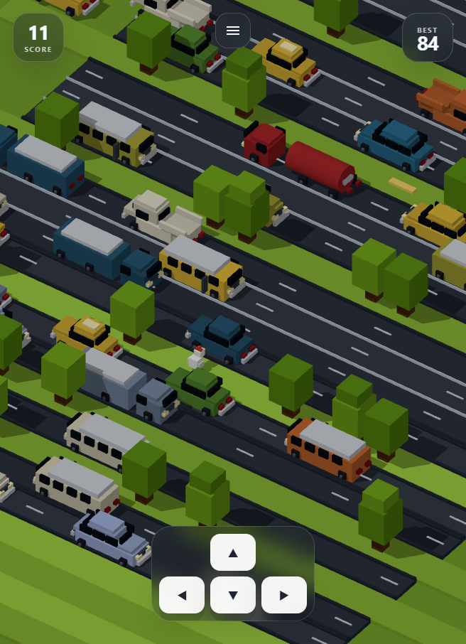

# Ayam SD

[](https://github.com/masarray/voxel-crossing-game/actions/workflows/ci.yml)
[](https://github.com/masarray/voxel-crossing-game/actions/workflows/deploy-pages.yml)


**Ayam SD** is a lightweight browser mini-game built with **React, Vite, and Three.js**. It features a voxel chicken, smart traffic, 3-lane and 4-lane roads, trains, rivers, sinking wooden planks, high-score rewards, lazy-loaded background music, sound effects, a five-question learning quiz after every third game over, tactile quiz feedback, near-miss thrill text, bottom-cannon confetti, and responsive controls for desktop and mobile.

Live demo after deployment:

```txt
https://masarray.github.io/voxel-crossing-game/
```



## Why this project exists

This project is designed as a compact, polished, and easily embeddable web game. It can run as a standalone GitHub Pages game or be integrated as a mini-game module inside an educational app, quiz app, or children-focused learning platform.

It intentionally avoids third-party game branding and official game assets. The game uses custom procedural geometry and neutral naming.

## Highlights

- **Fast Three.js voxel rendering** using procedural geometry instead of heavy image assets.
- **Responsive portrait and landscape gameplay** for desktop browser, tablet, and mobile.
- **Smart vehicle traffic** with lane spacing logic to reduce vehicle stacking and unnatural collisions.
- **Multiple road formats** including 3-lane and 4-lane road bands.
- **Vehicle variety** including cars, pickups, vans, buses, trucks, tankers, containers, modern trains, classic trains, freight trains, and bullet trains.
- **River hazard** with moving wooden planks that sink after being used too long.
- **Dramatic feedback** with screen shake, feather burst, splash effect, near-miss “NYARIS!” text, high-score reward, and three-star reveal animation.
- **Audio system** with lazy-loaded OGG background music, automatic music pause during quiz, and Web Audio sound effects.
- **Post-game learning loop** after every third game over with 5 randomized questions, shuffled answers, instant ballistic correct/wrong feedback, explanation text, and reward animation.
- **In-game settings menu** for restart, high-score reset, music on/off, and sound-effect on/off.
- **Automatic GitHub Pages deployment** through GitHub Actions.

## Quick start

```bash
npm install
npm run dev
```

Open the local Vite URL shown in the terminal.

## Controls

| Action | Keyboard | Mobile |
|---|---|---|
| Start / restart | `Space`, `Enter`, `WASD`, or arrow keys | Tap **Mulai Main** / **Main Lagi** |
| Move | `WASD` or arrow keys | Swipe or on-screen D-pad |
| Pause / menu | Menu button | Menu button |

## Build locally

```bash
npm run build
npm run preview
```

The production build is generated in `dist/`.

## Deploy to GitHub Pages

This repository includes automatic GitHub Pages deployment through:

```txt
.github/workflows/deploy-pages.yml
```

Deployment runs automatically on every push to `main` and can also be triggered manually from the **Actions** tab.

One-time GitHub setting:

1. Open the repository on GitHub.
2. Go to **Settings → Pages**.
3. Under **Build and deployment**, set **Source** to **GitHub Actions**.
4. Push to `main`.
5. Open the deployment URL from the workflow summary.

GitHub’s own Pages documentation recommends custom GitHub Actions workflows when a project needs a build process such as Vite, and the workflow here follows the Pages artifact pattern: checkout, build static files, upload Pages artifact, then deploy it.

## Repository setup

Suggested GitHub repository values:

```txt
Repository name : voxel-crossing-game
Description     : Lightweight Three.js voxel crossing browser game with cars, trains, rivers, music, mobile controls, and GitHub Pages deployment.
Website         : https://masarray.github.io/voxel-crossing-game/
Topics          : threejs, react, vite, web-game, voxel-game, browser-game, github-pages, educational-game, mobile-game
License         : Apache-2.0
```

See [GitHub setup guide](docs/GITHUB_SETUP.md) for the exact commands.

## Integration example

```jsx
import VoxelCrossing from './game/VoxelCrossing.jsx';

export default function MiniGameRoute() {
  return (
    <VoxelCrossing
      enableMilestoneCallback
      milestoneEvery={5}
      onQuestionGate={({ score }) => openQuestion(score)}
      onGameOver={({ score, highScore, reason }) => saveResult(score, highScore, reason)}
    />
  );
}
```

This allows the game to become a route module inside an educational app. For example, every 5 successful steps can trigger a quiz gate, reward checkpoint, or learning challenge.

## Project structure

```txt
.github/workflows/              CI and GitHub Pages deployment
public/audio/                   Lazy-loaded background music and reward SFX
public/data/questionBanks.json   Learning quiz question bank loaded lazily after game over
public/favicon.svg              App icon
src/game/VoxelCrossing.jsx      React wrapper, HUD, menu, settings, keyboard start/restart, quiz flow
src/game/RoadQuestGame.js       Three.js engine, camera, movement, collision, scoring
src/game/renderers.js           Voxel player, vehicles, trains, rivers, planks, particles
src/game/world.js               Procedural row generation and difficulty progression
src/game/audio.js               Lazy-loaded music player, procedural sound effects, quiz feedback and reward sounds
src/game/VoxelCrossing.css      HUD, controls, menu, overlays, reward animation
```

## Audio and licensing note

Source code is licensed under Apache-2.0.

The included files `public/audio/mushroom-dance.ogg` and `public/audio/kids-yay.mp3` are user-supplied media. The included `public/data/questionBanks.json` contains original practice questions supplied for learning use. Keep these assets only when you have the right to distribute them publicly. Otherwise, replace them with confirmed CC0, MIT, Apache-2.0, or properly licensed alternatives before publishing a public app.

More details are in [THIRD_PARTY_NOTICES.md](THIRD_PARTY_NOTICES.md) and [Asset licensing guide](docs/ASSET_LICENSING.md).

## Development notes

- The game is intentionally asset-light. Most visuals are generated from Three.js box/cuboid geometry.
- Background music is lazy-loaded so the game can start quickly even if audio is still loading.
- Reward audio is triggered only after user interaction and remains optional through settings.
- Browser autoplay rules require a user interaction before music can play. The Start/Menu buttons unlock audio.
- The Vite base path is automatically adjusted for GitHub Pages repository deployment.

## License

Apache License 2.0. See [LICENSE](LICENSE).
